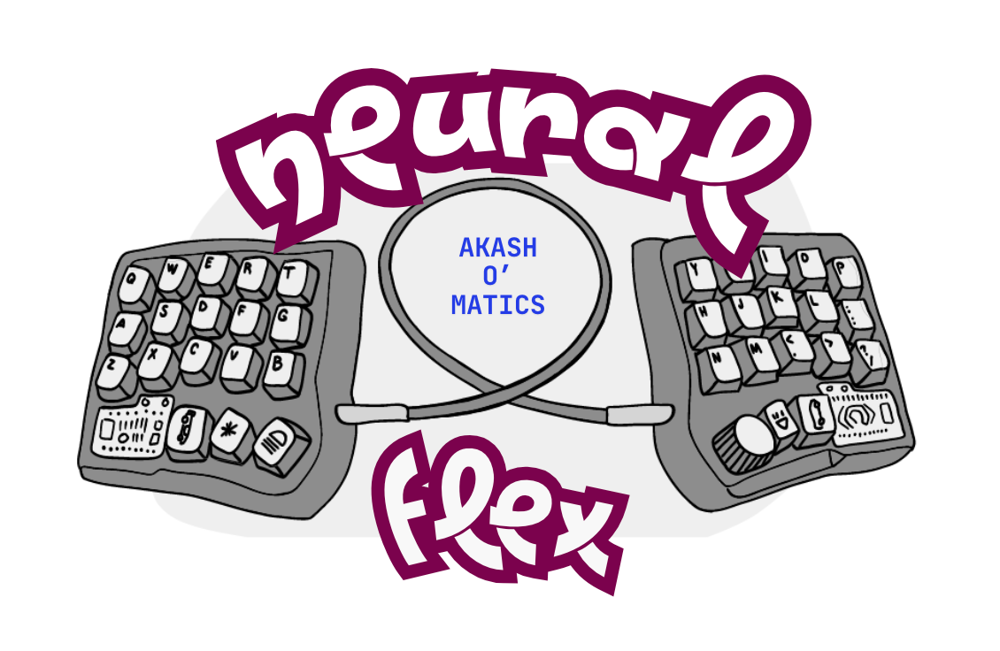
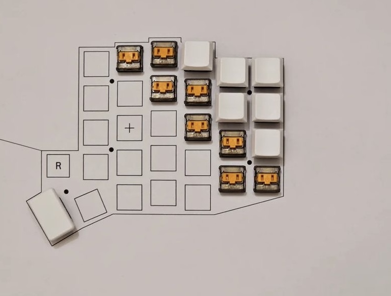
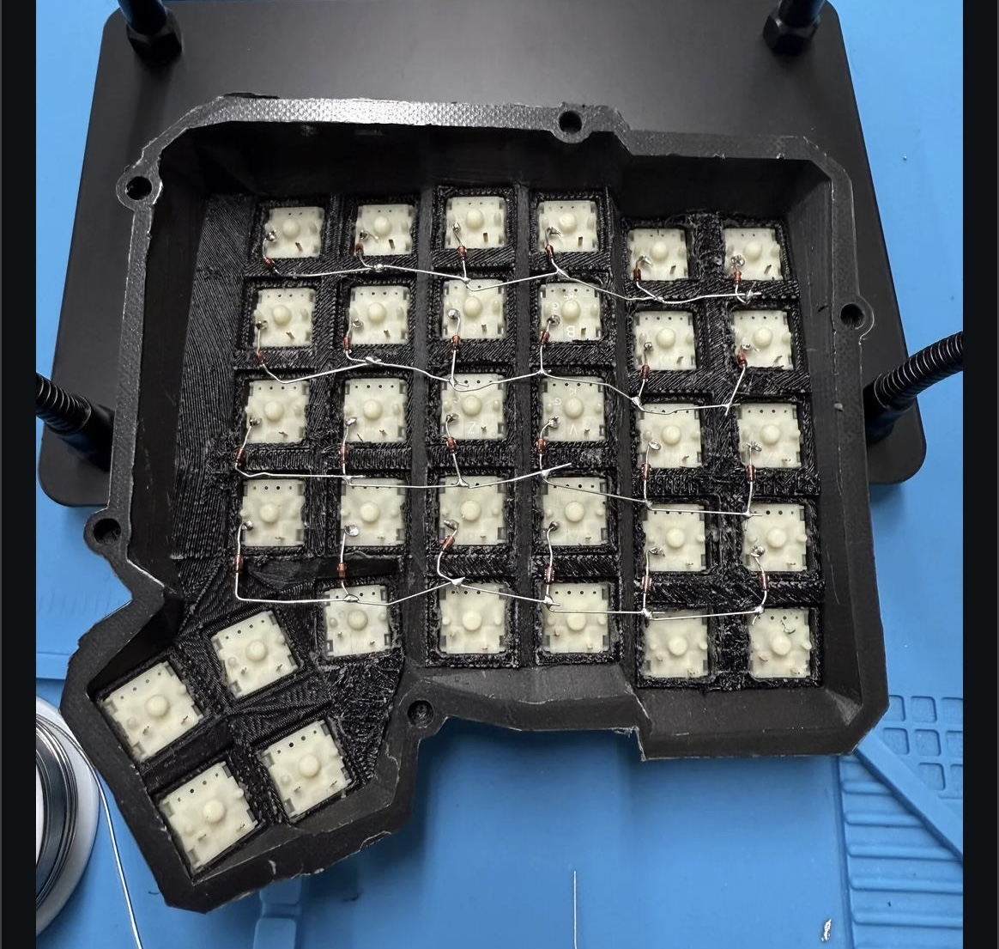
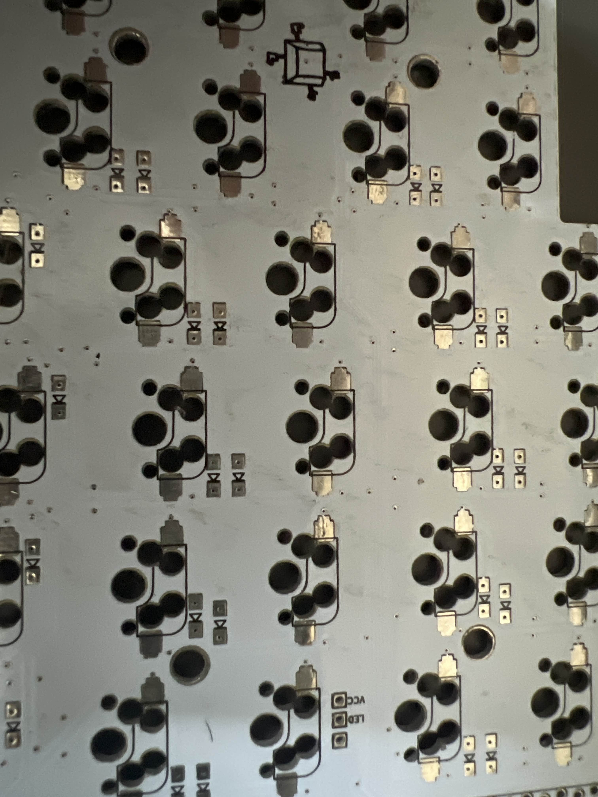
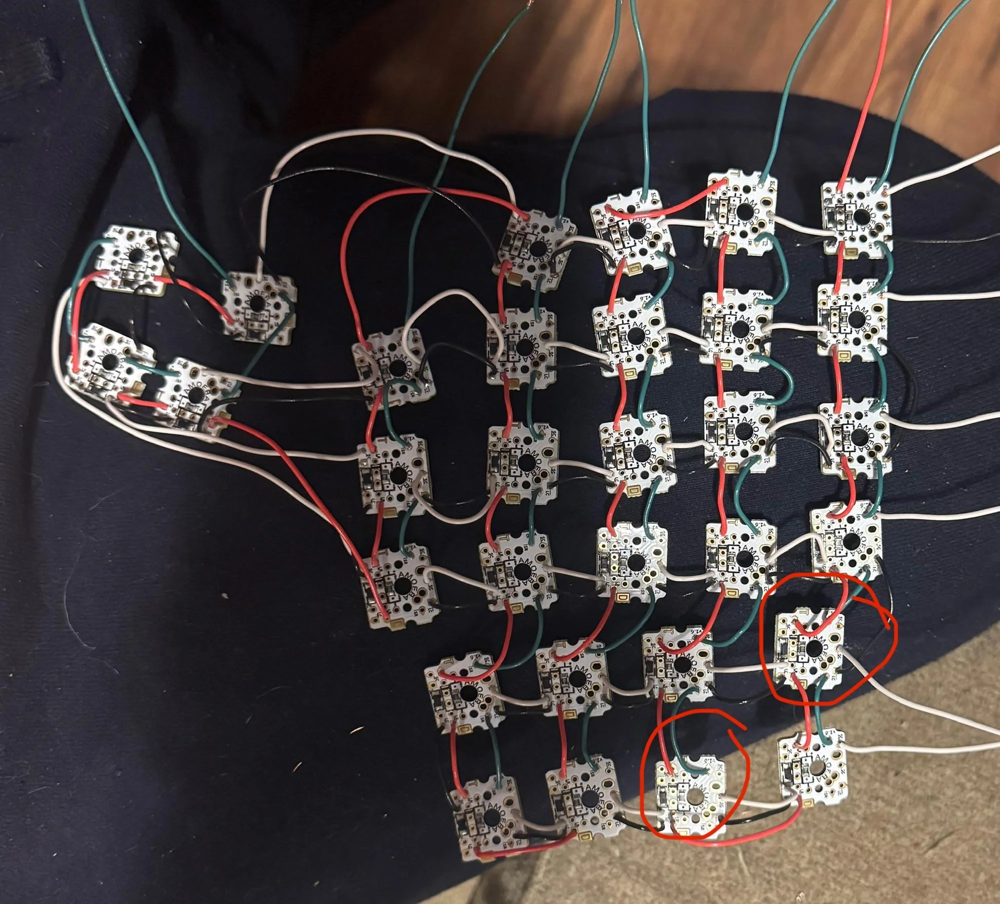
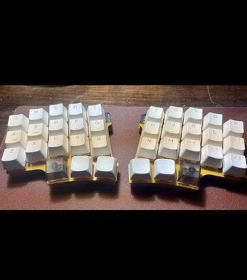

# NEURAL FLEX 

  

🚀 **Hack Faster, Code Longer!** An **ergonomic split keyboard** keeps your hands in a **natural position**, reducing strain so you can **Vim like a boss**—no more RSI slowing you down.

⌨️ **Modal Editing, Meet Peak Ergonomics!** Keep your fingers on **home row**, map keys to perfection, and **stay in the zone** with ultimate comfort.

🔥 **No More Pinky Pain, Just Pure Speed!** Tame your **keybindings**, master **efficiency**, and **outlast your deadlines**—because real coders optimize everything.

## Phases (Learning and Studying)
- 3D Modelling 
	- [ ] Autocad/ Solidworks learning : https://www.youtube.com/watch?v=2OdIF515FEg
	- [ ] How kicad_pcb file needs stp files :  https://github.com/sol/KBDevBoard/tree/main
- Firmware coding
	- [ ] What is QMK ? : https://browse.qmk.fm/#/
		- [ ] Keyboard QMK : https://github.com/qmk/qmk_firmware
	- [ ] Deployment on Arduino nano : https://www.youtube.com/watch?v=w87o1xF4uQw
	- [ ] Simulink for hardware MBD : https://www.youtube.com/watch?v=EP1rsGYHOh0&list=PLnfr5me4laRfAP01ecxGRPx42hwG-qJ3v
- 3D Printing
	- Openscad learning : https://www.youtube.com/watch?v=6o9H6VraCaw
	- Open source modelling files : https://gitlab.com/alexives/keyboard_lib
- PCB Fabrication
	- [ ] Study https://github.com/ruiqimao/keyboard-pcb-guide
	- [ ] How to design PCB geber files ? https://www.youtube.com/watch?v=d5jGt7FpBiA
	- [ ] Understanding Kicad designer for mechanical keyboard : https://www.youtube.com/watch?v=8WXpGTIbxlQ
	- [ ] Where to order ? 
- Plating
	- inspiration - opensource stl files : https://github.com/Bastardkb

## Building in public with pics

  

  

  

  

  

## Doubts
-  I have a TRRS cable and jacks, and I was planning to start out with a serial connection (three wires) first, and then see if I can notice any lag and switch to I2C (four wires) if I need to. Do people generally flash the same firmware to both sides? Or do you make separate hex files for left and right? If you use the same firmware how do you say which pins to use in the matrix? If you have pins 1-6 wired up for the columns on the left, does that mean you can't use pins 1-6 for the columns on the right? I used [kbfirmware.com](https://kbfirmware.com/) before. This time I'm going to start with that and then download the zip from there and tweak it and compile the hex from that.
-  Why use two micro's? The ergodox uses a teensy and an io expander, which is significantly cheaper than two teensy's (or micros or what have you). Why do the dactyls seem to use two main boards? Is this not possible because there's no pcb?

## References
- https://github.com/diimdeep/awesome-split-keyboards?tab=readme-ov-file
- https://www.reddit.com/r/ErgoMechKeyboards/comments/1iopk50/confusion_with_i2c_and_serial_connection/
- https://nurmi.me/posts/novum/
- https://github.com/tompi/cheapino
- https://github.com/chrisandreae/keyboard-firmware

## Personal motto 

**“Victory at all costs, victory in spite of all terror, victory however long and hard the road may be; for without victory, there is no survival.”**
-Winston Churchill during House of Commons

